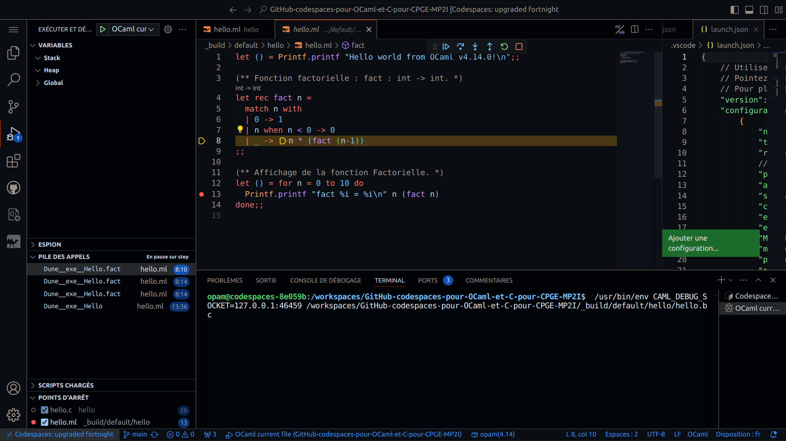
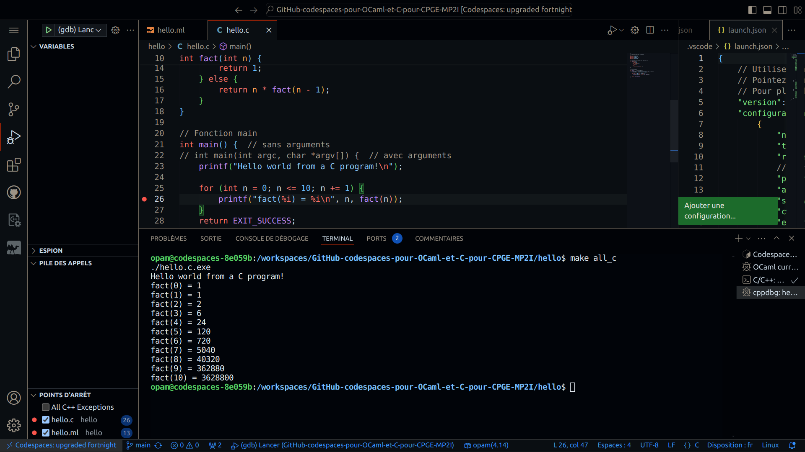
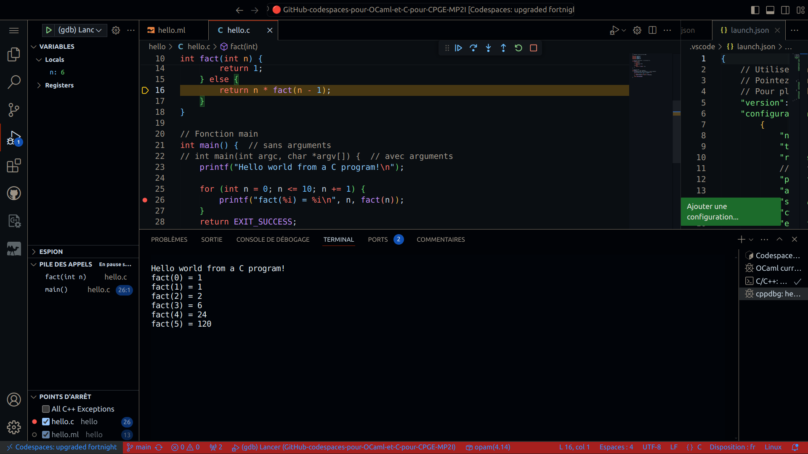

# GitHub codespaces pour OCaml et C pour coder en CPGE MP2I (2024)

Ce dépôt est un modèle pour utiliser [GitHub codespaces (https://github.dev)](https://github.dev) pour coder en [OCaml](https://ocaml.org) et [en C](https://fr.wikipedia.org/wiki/C_(langage)), en un clic dans un [environnement complet déployant Visual Studio Code en ligne](https://vscode.dev).

Les extensions nécessaires au bon développement en OCaml et en C sont incluses, VSCode est paramétré en français, et `make` est inclus pour écrire des `Makefile`.
Cet environnement de développement en ligne est proche de ce que les oraux de concours proposent.

## Comment s'en servir ?

- Il faut [avoir un compte GitHub](https://github.com/join), et être connecté à son compte ;
- Ici [sur cette page](https://github.com/Naereen/GitHub-codespaces-pour-OCaml-et-C-pour-CPGE-MP2I), cliquez en haut sur *"Use this template"* (bouton vert), et *"Open in a codespace"* ;
- Il faut ensuite attendre que la machine distante soit prête, cela peut-être assez long lors de la première utilisation.

> **Attention**, GitHub codespaces est gratuit pour un usage limité, il ne faut pas espérer pouvoir faire tourner en illimité du code gourmand. Voir [votre page *billing* dans vos paramètres](https://github.com/settings/billing/summary), ou [la documentation](https://docs.github.com/billing/managing-billing-for-github-codespaces/about-billing-for-github-codespaces).

-----

## Travailler en OCaml
Il faut travailler dans le fichier `hello.ml`, par défaut.

> Note : il est possible de travailler sur un projet nécessitant plusieurs fichiers, mais il vous faudra modifier le `Makefile`, éventuellement [les tâches de build](.vscode/tasks.json) et [les tâches de debug](.vscode/launch.json).
Ou tout faire à la main depuis un terminal...

### L'exécution de code OCaml est possible via un terminal `utop`
Dans le terminal embarqué, aller dans le dossier `hello/` (`cd hello/`), puis il faut lancer `utop`.
Un fois `utop` lancé, la commande `#use "hello.ml";;` exécute et interpréte le code du fichier [`hello.ml`](hello/hello.ml), avec les valeurs et les types joliment affichés.

### Débugguer le programme `hello.ml` avec OCaml ?
Avec [cette extension OCaml pour VSCode](https://marketplace.visualstudio.com/items?itemName=ocamllabs.ocaml-platform#debugging-ocaml-programs-experimental).
Il faut utiliser la configuration de débug `"OCaml current file"` pour le fichier [`hello.ml`](hello/hello.ml).

### Compiler et exécuter
Aussi possible ! Avec la règle de lancement `"OCaml générer le fichier actif (ocamlopt)"` ou `"OCaml exécuter le fichier actif"`.
Il faut ouvrir la palette, puis `"run tasks"` > choisir la tâche.

-----

## Travailler en C
Il faut travailler dans le fichier `hello.c`, par défaut.

> Note : il est possible de travailler sur un projet nécessitant plusieurs fichiers, mais il vous faudra modifier le `Makefile`, éventuellement [les tâches de build](.vscode/tasks.json) et [les tâches de debug](.vscode/launch.json).

### Compiler en C avec un `Makefile`
Ce [`Makefile`](hello/Makefile) prévoit tout ce qu'il faut normalement, pour un usage basique.

### Débugguer en C
C'est aussi possible. Avec la règle de débuggage "(gdb) Lancer".

### Compiler et exécuter depuis le menu
Aussi possible ! Avec la règle de lancement "C/C++: exécuter le binaire du fichier actif" ou "C/C++: gcc générer le fichier actif".
Il faut ouvrir la palette, puis "run tasks" > choisir la tâche.

----

## Autres remarques

### Ajouter des programmes
On peut utiliser `apt install nom_du_paquet` pour installer un ou plusieurs paquets, si certaines choses de base sont manquantes.

### Documentation ?
Voir cette page : <https://docs.github.com/fr/codespaces/overview> pour une documentation en français sur les `codespaces`.

### :scroll: License ? 
[MIT Licensed](https://lbesson.mit-license.org/) (file [LICENSE](LICENSE)).
© [Lilian Besson](https://GitHub.com/Naereen), 2024.

